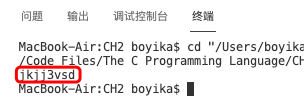
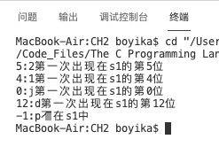
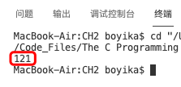
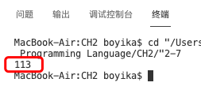
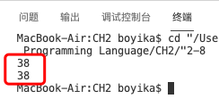
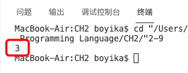
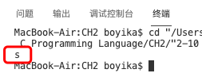

# C程序设计语言（第2版）-课后练习

## 前言：

代码都是在VS CODE上亲测有效的，此处不提供代码文件，有需要可自行拷贝测试。

## CH01 导言

**概述：** 第1章内容主要是通过将一些重要的概念拉出来，让大家了解什么是C语言，以及它能够干什么，里面也附有一些习题，对零基础人员来说有点难度，建议第一遍学习时看一下就行，先把后面的学习完后有时间可以在过来过一遍。


## CH02 类型、运算符与表达式

### 练习2-1

```c
/*
1.打印标准头中的相应值
*/
#include <stdio.h>
#include<limits.h>

int main()
{
    /*各数据类型取值范围*/
    /*signed types*/
    printf("signed char ：%d~%d\n",SCHAR_MIN,CHAR_MAX);
    printf("signed int ：%d~%d\n",INT_MIN,INT_MAX);
    printf("signed short ：%d~%d\n",SHRT_MIN,SHRT_MAX);
    printf("signed long ：%ld~%ld\n",LONG_MIN,LONG_MAX);

    /*unsigned types*/
    printf("unsigned char ：0~%u\n",UCHAR_MAX);
    printf("unsigned int max ：0~%u\n",UINT_MAX);
    printf("unsigned short max ：0~%u\n",USHRT_MAX);
    printf("unsigned long max ：0~%lu\n",ULONG_MAX);
}
```


```c
/*
2.直接计算
*/
#include <stdio.h>

int main()
{
    /*各数据类型取值范围*/
    
    int cMIN = -((unsigned char)~0>>1)-1;
    int cMax = -cMIN-1;
    printf("signed char ：%d ~ %d\n",cMIN,cMax);
    printf("unsigned char ：0 ~ %u\n",(unsigned char)-1);

    int iMIN = -((unsigned int)~0>>1)-1;
    int iMax = -iMIN-1;
    printf("signed int ：%d ~ %d\n",iMIN,iMax);
    printf("unsigned int ：0 ~ %u\n",(unsigned int)-1);

    int sMIN = -((unsigned short)~0>>1)-1;
    int sMax = -sMIN-1;
    printf("signed short ：%d ~ %d\n",sMIN,sMax);
    printf("unsigned short ：0 ~ %u\n",(unsigned short)-1);

    long lMIN = -((unsigned long)~0>>1)-1;
    long lMax = -lMIN-1;
    printf("signed long ：%ld ~ %ld\n",lMIN,lMax);
    printf("unsigned long ：0 ~ %lu\n",(unsigned long)-1); 
}
/*
(unsigned char) ~0 >> 1  是什么意思？

第一步：先是把数字0的各个二进制位全部转换为1；

第二步：然后，将结果值转换为unsigned char 类型 ；

第三步：然后右移一位。             


0默认为int型，占用4个字节，存储为0x00000000，~0的存储值为0xffffffff

sizeof(int) >= 2, sizeof(unsigned char) = 1
转换为unsigned char后存储为0xff，其值为255
>>1就是除以2，存储为0111 1111, 所以为255/2 = 127

所以(unsigned char)~0为ff（无符号），再右移一位为7f（即127）
*/
```


### 练习2-2

```c
/*
for (i=0 ; i<lim-1 && (c=getchar()) != '\n' && c!=EOF ; ++i)  没有&&和||的等价程序
*/

    enum loop{NO,YES};
    enum loop okloop = YES;
    
    i = 0;
    
    while (okloop == YES)
    {
        if (i>=lim-1)
            okloop = NO;
        else if((c=getchar())=='\n')
            okloop = NO;
        else if(c==EOF)
            okloop = NO;
        else
        {
            s[i] = c;
            ++i;
        }   
        
    }
```

### 练习2-3


### 练习2-4

```c
#include <stdio.h>
#include <string.h>
void squeeze(char str1[],char str2[]);

int main()
{
    char s1[] = "jkjj1232cvs2d";
    char s2[] = "2cbm1";
    squeeze(s1,s2);
    printf("%s\n",s1);
}

void squeeze(char str1[],char str2[])
{
    int i,j,k;
    for ( i=k=0 ; str1[i]!='\0' ; i++ )
    {
        for( j=0 ; str2[j]!='\0' && str2[j]!=str1[i] ; j++ )
            ;
        if (str2[j]=='\0')
            str1[k++]=str1[i];
    }
    str1[k] = '\0';
}
```



### 练习2-5

```c
#include <stdio.h>
#include <string.h>
void any(char str1[],char str2[]);

int main()
{
    char s1[] = "jkjj1232cvs2d";
    char s2[] = "21jdp";
    any(s1,s2);
}

void any(char str1[],char str2[])
{
    int i,j;
    for ( i=0 ; str2[i]!='\0' ; i++ )
    {
        for( j=0 ;   ; j++ )
            if (str2[i]==str1[j])
                {
                    printf("%d:%c第一次出现在s1的第%d位\n",j,str2[i],j);
                    break;
                }
            else if(str1[j]=='\0')
                {
                    printf("-1:%c不在s1中\n",str2[i]);
                    break;
                }
    }
}
```



### 练习2-6

注：二进制的第n位是从右向左数的！

```c
#include <stdio.h>
unsigned setbits(unsigned x,int p,int n,unsigned y);

int main()
{
    printf("%d\n",setbits(73,5,3,23));
}

unsigned setbits(unsigned x,int p,int n,unsigned y)
{
    return (x & ~(~(~0<<n)<<(p+1-n))) | (y & ~(~0<<n))<<(p+1-n);
}
/*
参考https://blog.csdn.net/taolusi/article/details/52400918?ops_request_misc=%257B%2522request%255Fid%2522%253A%2522163516149116780264010589%2522%252C%2522scm%2522%253A%252220140713.130102334..%2522%257D&request_id=163516149116780264010589&biz_id=0&utm_medium=distribute.pc_search_result.none-task-blog-2~all~sobaiduend~default-1-52400918.first_rank_v2_pc_rank_v29&utm_term=setbits&spm=1018.2226.3001.4187
*/
```



### 练习2-7

```c
#include <stdio.h>
unsigned invert(unsigned x,int p,int n);

int main()
{
    printf("%d\n",invert(73,5,3));
}

unsigned invert(unsigned x,int p,int n)
{
    return (x ^ (~(~0<<n)<<(p+1-n)));
}
```



### 练习2-8

```c
#include <stdio.h>
/*
本题通过下面两种方法实现
*/

unsigned rightrot_way1(unsigned x,int n);
unsigned rightrot_way2(unsigned x,int n);
int worldlength(unsigned v);

int main()
{
    printf("%d\n",rightrot_way1(73,5));
    printf("%d\n",rightrot_way2(73,5));

}

unsigned rightrot_way1(unsigned x,int n)
{
    /*
    x循环右移n位，那就先得到最右边n位，然后将x右移n位，此时最左边n位为0，再将得到的最右边n位放到最左边。
    对于这种会出现循环的情况来说，需要考虑的一点就是机器使用的字长问题，如果n大于机器字长，那么循环机器字长的倍数次相当于没有移动
    */
    int rbit;
    int l=worldlength(x);
    while (n-- > 0)
    {
        rbit = (x & 1) <<(l-1);
        x = (x >> 1) | rbit;
    }
    return x;
}

unsigned rightrot_way2(unsigned x,int n)
{
    /*
    每次都向右移动一位，一共移动n次
    */
    unsigned rbits;
    int l=worldlength(x);
    if((n = n % l) > 0)
    {
        rbits = ~(~0 << n) & x;
        rbits = rbits << (l - n);
        x = (x >> n) | rbits;
    }
    return x;
}

int worldlength(unsigned v)
{
    int i;
    for (i=1 ; (v=v>>1)>0 ; i++)
        ;
    return (i);
}
```



### 练习2-9

```c
#include <stdio.h>
int bitcount(unsigned x);

int main()
{
    printf("%d\n",bitcount(73));
}

int bitcount(unsigned x)
{
    int b;
    for (b=0 ; x!=0 ;x &= x-1)
        b++;
    return b;
}
/*
原来的方法（书40页）执行的步数为x的长度
而此方法执行的步数是1的个数，步骤小于等于原方法步骤（当所有位均为1时，步骤相等）
*/
```



### 练习2-10

```c
#include <stdio.h>
int lower(int c);

int main()
{
    printf("%c\n",lower('S'));
}

int lower(int c)
{
    return(c >= 'A' &&  c <= 'Z' ? c + 'a' - 'A' : c);
}
```



## CH03 控制流


## CH04 函数与程序结构


## CH05 指针与数组


## CH06 结构


## CH07 输入与输出


## CH08 UNIX系统接口


